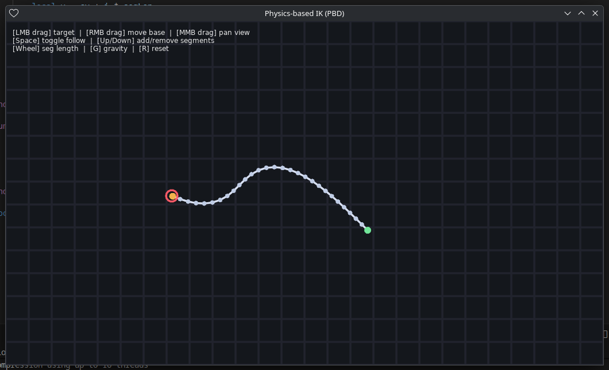

# Physics-Based IK Demo (LÖVE / Love2D)

A minimal interactive demo of **inverse kinematics** using **position-based dynamics**  
built with [LÖVE (Love2D)](https://love2d.org/).



---

## Features
- **Physics-like rope IK** using verlet + constraints.
- **Interactive target**: drag with left mouse.
- **Move base node**: drag with right mouse.
- **Pan camera**: drag with middle mouse.
- **Adjust chain**:
  - ↑ / ↓ to add/remove segments  
  - Mouse wheel to change segment length  
- **Other controls**:
  - Space: toggle auto-follow mouse  
  - G: toggle gravity  
  - R: reset chain

---

## Run
```bash
love .
````

Requires **LÖVE 11.x**.

---

## License

This project is licensed under the [MIT License](LICENSE) © 2025 Don J. B.